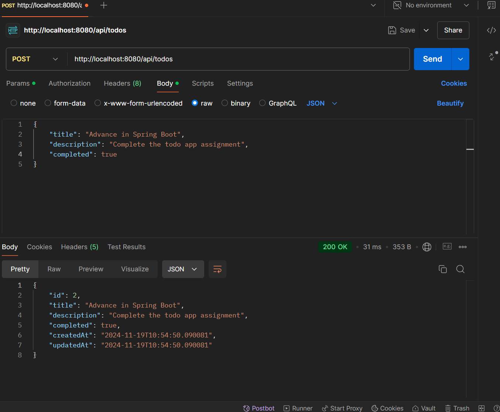
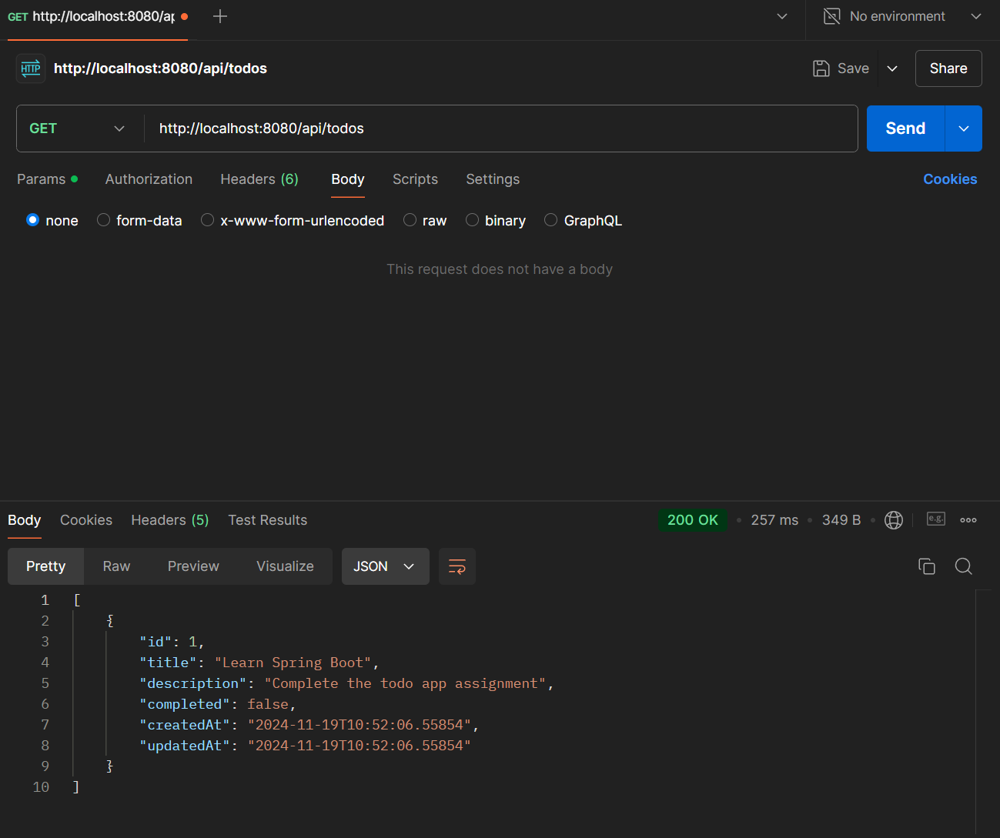
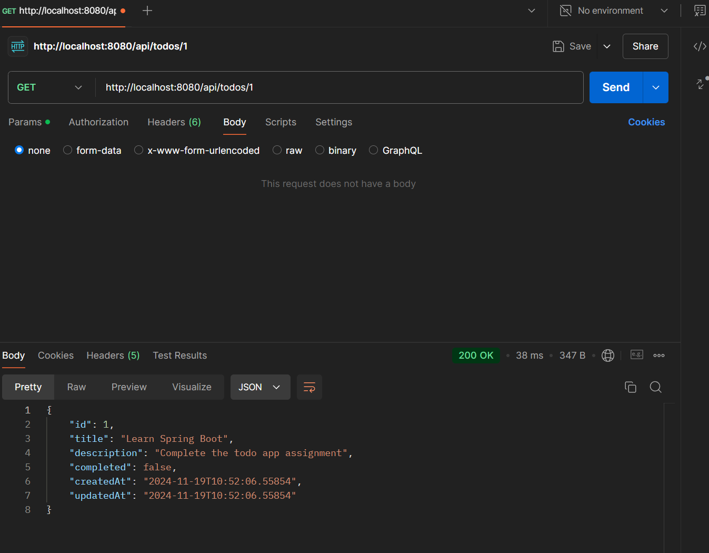
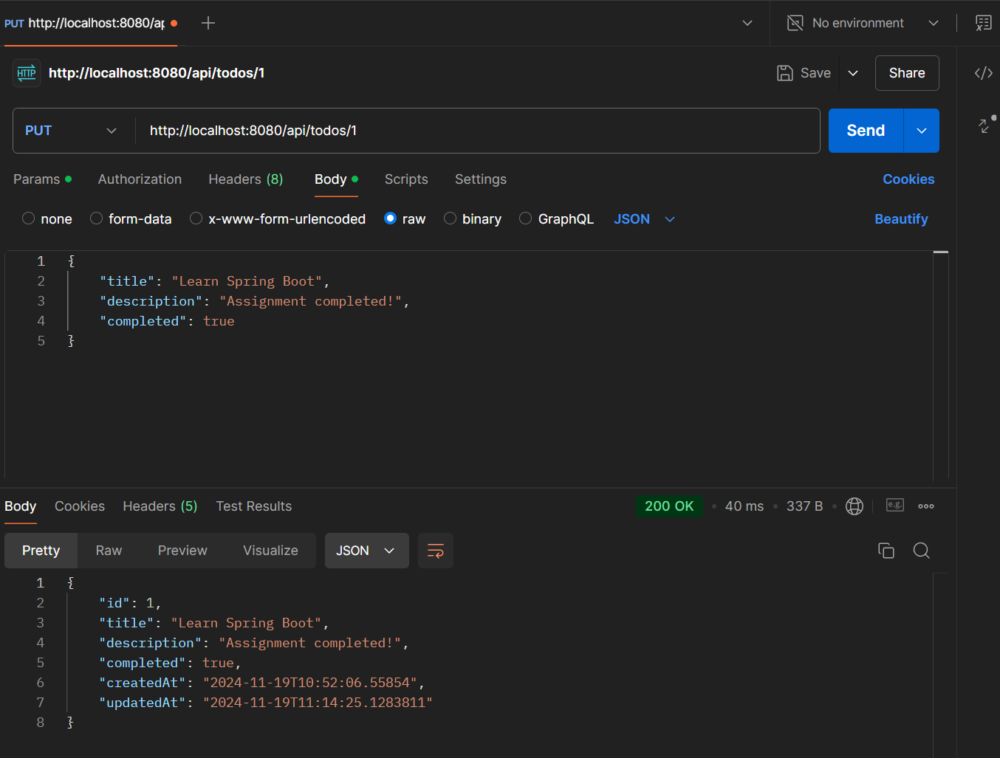
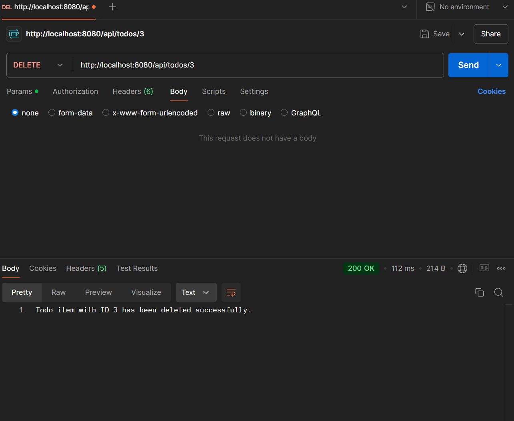
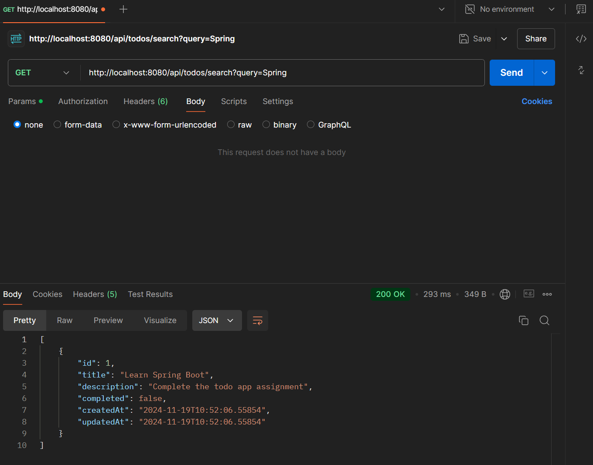

# Spring Boot Assessment To-Do App 

## Dependencies

- **Spring Web**
- **Spring Data JPA**
- **MySQL Driver**
- **Lombok**

## Functionalities

### 1. **Create a To-Do Item**

### 2. **Get All To-Do Items**

   
### 3. **Get a To-Do Item by ID**

### 4. **Update a To-Do Item**

### 5. **Delete a To-Do Item**

### 6. **Search To-Do Items by Title**

## References
- [Video 1](https://www.youtube.com/watch?v=9SGDpanrc8U)
- [Video 2](https://www.youtube.com/watch?v=YVl6M5ztOu8)
- [Spring Quickstart](https://spring.io/quickstart)
- [Spring Boot Guide](https://spring.io/guides/gs/spring-boot)
- [Maven Download](https://maven.apache.org/download.cgi)
- [ChatGPT Share](https://chatgpt.com/share/673c2be0-ddf8-800d-8445-272644c0d4f3)

